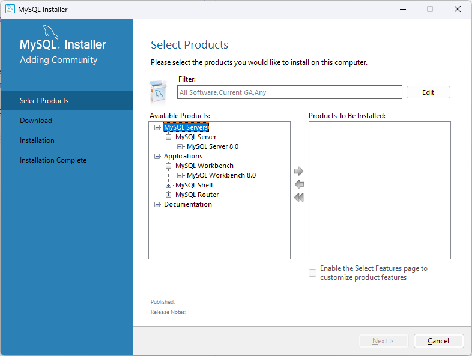
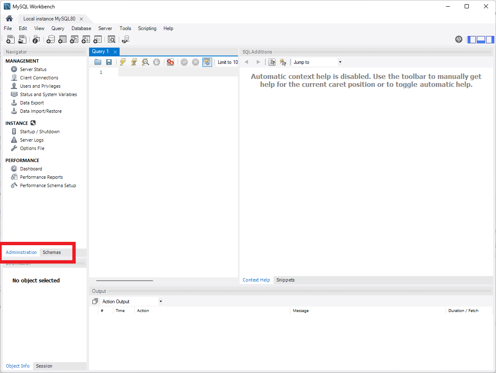
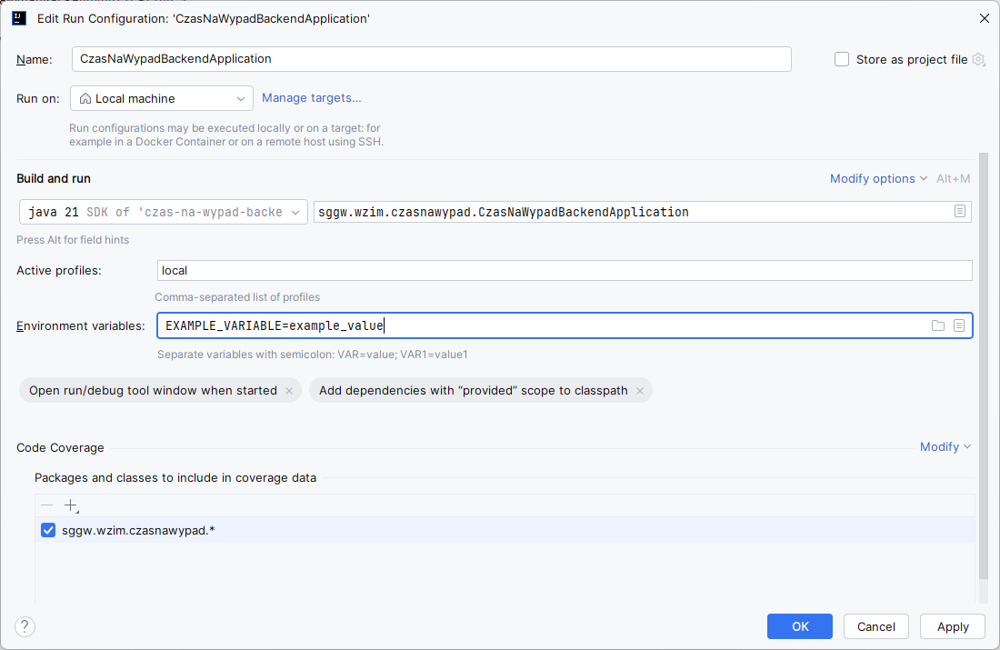

<center><h1>czas-na-wypad API</h1></center>

# Podsumowanie

* Aplikacja napisana w Spring Boot 3.3.4 i Java 21
* Baza Danych MySQL 8.0.40

# Lokalne zestawienie aplikacji

## Serwer MySQL i MySQL Workbench

Aby zainstalować serwer MySQL potrzebny do uruchomienia aplikacji należy wejść w ten [link](https://dev.mysql.com/downloads/windows/installer/8.0.html)
i pobrać wersję Online lub Offline instalatora.

Podczas instalacji należy wybrać MySQL Server 8.0.40 oraz MySQL Workbench 8.0.40 (jak na zrzucie ekranowym)


Podczas instalacji hasło do konta `root` w bazie danych należy ustawić na: `q1w2e3r4T`.

Po instalacji oprogramowania należy uruchomić program MySQL Workbench. Przy pierwszym uruchomieniu poprosi on nas o skonfigurowanie połączenia do bazy danych, w którym należy podać hasło (podane powyżej) do użytkownika `root`.
Następnie po prawidłowym połączeniu, w interfejsie użytkownika zmienić z `Administration` na `Schemas`: 

W widocznym edytorze `Query1` należy wykonać polecenie:

```sql
CREATE SCHEMA IF NOT EXIST czas_na_wypad;
```

## Utworzenie konfiguracji uruchomienia

1. Przejść do głównej klasy [CzasNaWypadBackendApplication](src/main/java/sggw/wzim/czasnawypad/CzasNaWypadBackendApplication.java)
2. Nacisnąć :arrow_forward: przy nazwie klasy głównej i wybrać opcję `Modify Run Configuration...`
3. Powinno być widoczne następujące okno:

4. Następnie trzeba ustawić `Active profiles` na `local`
5. Dodać zmienne środowiskowe wg tabeli poniżej (konieczne może być kliknięcie `Modify options` i dodanie `Environment variables`)

## Zmienne środowiskowe

Poniższe zmienne środowiskowe należy dodać do `Run configuration`

| Nazwa zmiennej      | Opis                                                   |
|---------------------|--------------------------------------------------------|
| DATASOURCE_USER     | Nazwa użytkownika, który zostanie użyty do bazy danych |
| DATASOURCE_PASSWORD | Hasło do użytkownika bazy danych                       |
